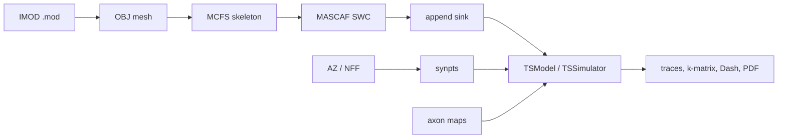

# Toric spines

Arbor simulations of barn-owl **toric spines** ([Sanculi et al., 2020](https://doi.org/10.1523/ENEURO.0197-19.2019)). These are large, hole-containing (genus > 0) spines on **space-specific neurons (SSNs)** in the external nucleus of the inferior colliculus (ICx). The scientific goal is to characterize how an isolated spine integrates synaptic input, including electrical leak into the rest of the cell.

This documentation is a collaborator-facing overview of the **research project**, not only the Python package. It covers reconstruction → skeleton → cable model → simulation, plus the software that sits around this repo.

## What we are asking

An isolated toric-spine mesh is not a whole neuron. The working model is:

1. Reconstruct the spine surface (and active zones) from EM.
2. Fit a 1D cable (SWC) that preserves volume, surface area, and topological loops.
3. Attach a cylindrical **sink** at the neck so charge can leak into a stand-in for dendrite/soma.
4. Drive synapses from axon maps and record voltages (sink, compartments, Dash / PDF / k-matrix).

Sanculi et al. reconstructed 76 toric spines on Type I SSNs (Type II cells have ordinary spines). Individual toric spines can collect many active zones from many axons, while remaining unconnected to most nearby axons — a candidate locus of integration and learning.

A parallel comparison morphology — a synthetic dendrite with classical neck+head spines — lives in `toric_spines_sim.geometry.dendrite` (see `notebooks/examples/spiny_dendrite_demo`). [Neurosignature](neurosignature.md) compares systems by descriptors of input–output dynamics rather than by geometry. A full “SSN whole-cell” reconstruction pipeline is **not** in this repo; work here is isolated spines plus a sink.

## Pipeline

Supported automation for skeletonization and cable fitting is **in this repo** via [pymcfs](https://github.com/jmrfox/pymcfs) and [mascaf](https://github.com/jmrfox/mascaf) (`uv sync`, then `scripts/skeletonize_meshes.py` / `scripts/fit_swc.py`). [CGAL](https://www.cgal.org/) / CGALLab remain valid for interactive mesh repair and for exploring mean-curvature skeletonization by hand; they are not required to run the current pipeline.

High-level path in code: mesh → skeleton → SWC (`# CYCLE_BREAK` / `# MULTI_NECK`) → sink → `TSModel` / `TSRecipe` → event generators → `TSSimulator.run()` → traces, k-matrix, Dash / PDF.

## Where to go next

- [Getting started](getting-started.md) — clone, `uv sync`, NMODL catalogue
- [Software](software.md) — uv, Arbor, and the satellite packages
- [From IMOD to mesh](reconstruction.md) — `imod2obj`, NFF active zones, neckpoints
- [Skeletons](skeletons.md) — MCFS, pymcfs vs CGALLab, parameterization
- [Morphology pipeline](morphology.md) — the commands used for spines in `data/`
- [Simulations](simulations.md) — per-spine axon studies
- [Neurosignature](neurosignature.md) — functional descriptors (event-in / signal-out systems)
- [Glossary](glossary.md) — SWC, cable model, genus, MorphologyGraph
- [Package tour](package.md) and [API](api/index.md) — the Python library
