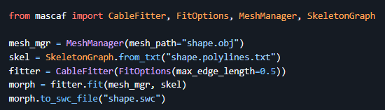

# Morphology pipeline

Commands used for spines already in `data/`, from closed OBJ to a simulation-ready sink SWC. If you are starting from IMOD, convert the surface and AZs first ([From IMOD to mesh](reconstruction.md)). Skeletonization details and the CGALLab alternative: [Skeletons](skeletons.md).

Skeletonization and SWC fitting use [pymcfs](https://github.com/jmrfox/pymcfs) and [mascaf](https://github.com/jmrfox/mascaf), installed with `uv sync`.

CHOLMOD is not required for pymcfs. On Linux or macOS it can speed up **large**-mesh skeletonization:

```bash
# Linux / WSL
sudo apt install libsuitesparse-dev
# macOS
brew install suite-sparse
```

You can process one spine (`TS1.obj`) or every `TS*.obj` (`--all`). A worked example on TS1 is `notebooks/tutorial/` (`01_meshes`–`07_synapses`). Set `SHOW_ALL = True` in those notebooks to review every spine.

## 1. Organize meshes

Place closed TS meshes at `data/mesh/TS{id}.obj`. Keep the cell mesh at `data/mesh/cell_wrapped_simplified.obj` if you will compute neckpoints.

## 2. Skeletonize

Mean-curvature flow via **pymcfs** → `data/skeletons/TS{id}.polylines.txt`. Defaults match pymcfs `profile="auto"`, `branching="sparse"`, tip extension on, 500 iterations, 300s timeout. This is the supported path; CGALLab is optional for interactive work.

```bash
uv run python scripts/skeletonize_meshes.py TS1.obj
uv run python scripts/skeletonize_meshes.py --all
```

Review mesh vs skeleton in `notebooks/tutorial/02_skeletonization_basic` (`SHOW_ALL = True`).

## 3. Fit SWC cables

mascaf fit → `data/swc/pixels/TS{id}.swc`. SWC is a tree, so cycle-forming node pairs are stored as `# CYCLE_BREAK` (and `# MULTI_NECK` when needed) comments. Those directives are read when building the Arbor model so loops become gap junctions.

`FitOptions.max_edge_length` is the maximum MorphologyGraph edge length in mesh coordinates. A larger maximum edge length produces coarser compartments. This repo sets it to a fraction of the mesh bounding-box diagonal (`--max-edge-length-frac`, default 0.08) so spines of different sizes share a relative resolution. Prefer the largest maximum edge length that still matches mesh structure, volume, and surface area. `--basis-optimize` runs mascaf’s basis refinement before radius fitting.



```bash
uv run python scripts/fit_swc.py TS1.obj
uv run python scripts/fit_swc.py --all --basis-optimize --verbose
```

Review mesh vs SWC in `notebooks/tutorial/04_swc_cable_fit` (`SHOW_ALL = True`).

## 4. Neckpoints (recommended before the sink)

Compare each isolated mesh to the full cell mesh → `data/pointsets/pixels/TS{id}_neckpoint.txt`. `append_sink.py` uses this file when present; otherwise it attaches at the SWC root.

```bash
# Single-neck spines: keep the largest detected cap
uv run python scripts/compute_neckpoints.py TS1 TS2 TS4 TS24 TS48 TS76 --max-necks 1
# Multi-neck / review without writing
uv run python scripts/compute_neckpoints.py TS3 --dry-run
uv run python scripts/compute_neckpoints.py TS21 --max-necks 2
uv run python scripts/compute_neckpoints.py TS67 --max-necks 1
```

## 5. Append a cylindrical sink

The isolated spine must leak into a stand-in for the dendrite/soma. The default sink is a 10 µm-radius cylinder. The script writes **both** pixel and micron SWCs:

- `data/swc/pixels/TS{id}_wsink_r10um.swc`
- `data/swc/microns/TS{id}_wsink_r10um.swc`

```bash
uv run python scripts/append_sink.py TS1 TS2
uv run python scripts/append_sink.py --all
uv run python scripts/append_sink.py TS1 --radius-um 20
```

Review in `notebooks/tutorial/05_neck_points`, `06_sink_attachment`, and `07_synapses` (`SHOW_ALL = True` on the sink gallery). SWC tags used throughout: spine=3, sink=5, sink tip=6.

## 6. Synapse coordinates (for simulation)

If you have NFF active-zone files, convert them and project onto the cable:

```bash
uv run python scripts/active_zones_from_nff.py
```

That writes pixel AZ files and `data/pointsets/microns/TS{id}_synpts.txt`. Axon maps in `data/ts_axons/` are one axon per line, comma-separated **1-based** synapse indices covering `1..N`. `ts1_axons.txt` is the real TS1 map; the other `ts*_axons.txt` files are placeholders. TS21 and TS24 have sink SWCs but no synpts yet, so they are not wired into `simulations/`.

Library equivalents (same defaults as the CLIs):

```python
from toric_spines_sim.geometry import skeletonize_mesh, fit_swc
from toric_spines_sim.geometry.mesh_pipeline import (
    default_polylines_path,
    default_swc_path,
    resolve_mesh_path,
)

mesh = resolve_mesh_path("TS1.obj")
skeletonize_mesh(mesh, default_polylines_path(mesh))
fit_swc(mesh, default_polylines_path(mesh), default_swc_path(mesh))
```
