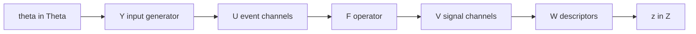

# Neurosignature

**Neurosignature** is a **work-in-progress** mathematical framework and corresponding [Python package](https://github.com/jmrfox/neurosignature). 
The goal is to characterize dynamical simulations by *descriptors* (e.g., composed from summary statistics), conditional on an input ensemble, allowing quantitative comparison of systems based on dynamics rather than by mesh geometry or by raw trace shape.

The system simulation is treated as a **multi-channel event-valued input → multi-channel signal-valued output** operator: an array of point-process streams goes in, and an array of continuous signals comes out. 
A multicompartmental simulation of a toric spine (many synapses, voltages everywhere) is one instance of this. A Continuous-Time Recurrent Neural Network (CTRNN) with several inputs and several outputs is another instance — that is what `notebooks/neurosignature_example.py` uses. Nothing in the framework requires a spine, a neck, or even a neuron.

The standalone package is [neurosignature](https://github.com/jmrfox/neurosignature). In this repo it is an optional extra (`uv sync --group neurosignature`). The TS1 wiring is `simulations/ts1/neurosignature/ts1_neurosignature.py`. You do not need it to run axon studies.

The current design measures **internal activity against a downstream output** via residuals, residual energy, and transfer efficiency. Users are encouraged to expand this framework. Building descriptor functions that are robust and can be compared meaningfully is challenging; see [Caveats](#caveats).

## Why not just compare morphologies?

In a simulation, the morphology, synapse locations, and membrane mechanisms define a map from event streams to voltages. The question is: **how do morphology and parameters change the function and dynamics of that system?**

In this approach, we embed each system in a descriptor space under a biologically relevant input generator, then measure similarity and/or distance between embeddings. Two spines that look different in shape could be close as dynamical operators, and vice versa, depending on how one defines the descriptors.

As it applies to toric spines, the relevant question to neuroscience is: why does the owl brain go through the trouble of creating such morphologically complex structures? What can we tell by analyzing the spine morphology itself?

## The spine as a special case

A convenient example is a spine with many synaptic inputs and **one neck**. Two views of the same run disagree about what the “output” is:

- **The simulator** can record \(V(t)\) in every compartment: the full internal picture, including how charge moves through loops and heads.
- **The neuron** only continues from the spine neck. Downstream dendrite and soma never see the internal traces, only the neck voltage \(v_{\mathrm{out}}(t)\). AP doesn't care about internal activity.

Both views are scientifically interesting. Internal dynamics may explain *why* two necks look similar or different; the neck is what actually couples the spine to the cell. The current package design is to measure internals **relative to** the downstream channel: residuals, residual energy, and transfer efficiency. See [Residuals](#residuals).

## Setup

Treat the simulator (spine, CTRNN, or otherwise) as an operator with \(N_U\) event channels and \(N_V\) signal channels. For a spine, \(N_U\) is the number of synapses and \(N_V\) the number of recorded compartments. In general neither count is special.

\[
F : \mathcal{U} \to \mathcal{V}.
\]

An input \(U = \{u_i\}_{i=1}^{N_U} \in \mathcal{U}\) is an array of size \(N_U \times N_T\) (one event stream per input channel, \(N_T\) time samples). An output \(V = \{v_i\}_{i=1}^{N_V} \in \mathcal{V}\) is \(N_V \times N_T\) (one continuous signal per output channel). \(F\) is whatever turns events into signals (e.g., a simulation). It may be stochastic; for the design we treat it as a map.

We want to plug in realistic inputs and mine the output \(V\) for information about \(F\), conditional on the input-generation model parameters \(\theta\).

Two systems generally differ in the shapes of \(U\) and \(V\), so we generally cannot compare inputs and outputs directly. We introduce two maps:

1. \(Y : \Theta \to \mathcal{U}\) — input generator from a low-dimensional parameter space into event streams
2. \(W : \mathcal{V} \to \mathcal{Z}\) — descriptor that turns the multi-channel output into a fixed-length summary, independent of channel count and ordering

The pipeline is

\[
\Theta \xrightarrow{Y} \mathcal{U} \xrightarrow{F} \mathcal{V} \xrightarrow{W} \mathcal{Z}.
\]



In this repo, \(F\) is `TSSimulator.run()` (voltage traces as a pynapple `TsdFrame`). \(Y\) is `neurosignature.InputGenerator` (Poisson rates, etc.). \(W\) is a `VectorDescriptor` of scalar components. For TS1 the **reference channel** is the neck probe; that is how this application names the downstream output, not part of the definition of \(F\).

## Input map \(Y : (\Theta, N_U) \to \mathcal{U}\)

\(\Theta\) is a low-dimensional description of an input ensemble. Examples:

- total event rates
- correlation structure (axons shared across synapses)
- temporal modulation (pulses, sinusoids, steps)
- latent stochastic variables (RNG seeds)

\(Y\) is stochastic: \(U \sim Y(\theta|N_U)\). A simple \(Y\) is a total rate plus a discrete distribution over \(N_U\) streams (inhomogeneous routing). If several synapses share an axon, those streams should be highly correlated — the same idea as the axon maps in [Simulations](simulations.md), when the system happens to be a spine.

The point of keeping \(\Theta\) small is interpretability: a descriptor \(z(F\mid\theta)\) is always “the signature of \(F\) **under this probing ensemble**,” not a universal fingerprint.

Crucially, \(\Theta\) is completely independent of \(N_U\). This way, we can supply two systems of different input dimension with samples from the same input generation model. 

## Output map \(W : \mathcal{V} \to \mathcal{Z}\)

\(\mathcal{Z}\) is \(N_Z\)-dimensional and must not depend on which system is being analyzed in a trivial way (no dependence on \(N_V\), \(N_T\), or channel ordering).

\(W\) can look at any subset of the \(N_V\) signals. When the application has a privileged downstream channel — a spine neck, a soma, a designated CTRNN readout — the package’s current \(W\) is built around residuals of the other channels against that output.

(Note that *technically* \(U\) and \(V\) don't have to be simple arrays of events and signals, respectively. For instance, \(V\) may include some extra information relevant to the system that is not contained in the simulation output itself, such as which compartments connect to the rest of the cell. This is useful for designing informed descriptors.) 


### Residuals

The point of the current design is to compare **internal activity to the downstream output**. Treat a reference channel as \(v_{\mathrm{out}}\) (the neck for a spine), then form the residual array

\[
R = \{r_i\}_{i=1}^{N_V} = \{v_i - v_{\mathrm{out}}\}_{i=1}^{N_V}.
\]

Descriptors of \(v_{\mathrm{out}}\) summarize what leaves the system; descriptors of \(R\) summarize how much the interior disagrees with that output.

**Residual energy** — how much internal activity deviates from \(v_{\mathrm{out}}\):

\[
\sum_i \int (r_i(t))^2 \, dt.
\]

**Transfer (transmission) efficiency** — how much of the activity is visible downstream versus remaining inside:

\[
\frac{\mathrm{Var}(v_{\mathrm{out}})}{\sum_i \mathrm{Var}(r_i)}.
\]

This is the current design of the package. \(W\) is a `VectorDescriptor` you can extend; users are encouraged to add components.

The TS1 script uses a 12-component `VectorDescriptor` (reference std and spectral centroid; residual mean, std, energy, spectral-centroid mean/std, participation ratio, max eigenvalue, eigenvalue entropy; cross-correlation mean; transmission efficiency), with the reference probe nearest `TS1_neckpoint.txt`.

## System descriptors \(z\)

Given \(Y(\theta)\) and \(F\),

\[
z(F\mid\theta) = W(F(U)), \qquad U \sim Y(\theta).
\]

In general \(z \sim P(z\mid F,\theta)\): the descriptor is a random variable because \(Y\) (and possibly \(F\)) is stochastic.

**Wanted**

- Sensitivity to functional dynamics, internal propagation (morphology), passive vs active (ion channels)
- Stability under small changes of \(\theta\)
- Interpretability given the probing ensemble
- A notion of **functional equivalence**: \(F_1 \neq F_2\) as maps, but \(z(F_1\mid\theta) \approx z(F_2\mid\theta)\) means the two systems are interchangeable *under that input model*
- When a privileged output exists, a clear story for internals versus downstream (residuals, residual energy, transfer efficiency)

**Not wanted**

- Dependence on \(N_V\), \(N_T\), or compartment ordering
- Over-sensitivity to isolated stochastic events
- Dominance by trivial gain (a global scale factor that does not change integration)

Sanity checks during development: \(z(F\mid\theta)\) should be reasonably stable under changes of spatial discretization, number of compartments, and recording timestep. Meeting them in practice is [hard](#descriptor-design-is-hard).

Functional equivalence is the scientifically useful failure mode. A toric spine and a synthetic spiny dendrite ([`geometry.dendrite`](package.md)) that match in \(z\) under the same \(\theta\) are “the same operator” for that ensemble, even if genus and SWC graphs differ. A mismatch isolates *functional* consequences of loops, neck geometry, or biophysics.

## Distances: points vs distributions

Embed systems in \(\mathcal{Z}\), then define a distance on the space of operators \(\mathcal{F}\). Two options.

### Point estimates

Draw one (usually long) stream \(U \sim Y(\theta)\). Let \(z_1 = W(F_1(U))\) and \(z_2 = W(F_2(U))\). Define

\[
D(F_1, F_2\mid\theta) = d(z_1, z_2)
\]

with \(d\) Euclidean, then a similarity such as \(\mathrm{sim} = \exp(-D)\) or cosine similarity

\[
\mathrm{sim}(F_1, F_2) = \frac{z_1 \cdot z_2}{\|z_1\|\,\|z_2\|}.
\]

Using the **same** \(U\) for both systems removes one source of trial noise.

The limitation: one finite-\(T\) trial only spans the full dynamic range of \(F\) under \(\theta\) as \(T \to \infty\).

### Distributions

Run many trials \(U^j\) and treat \(z^j = W(F(U^j))\) as samples from \(P(z\mid F,\theta)\):

\[
\begin{aligned}
Z_1 &= \{z^j_1\}_{j=1}^{N_{\mathrm{samples}}}, & z^j_1 &\sim P(z\mid F_1,\theta), \\
Z_2 &= \{z^j_2\}_{j=1}^{N_{\mathrm{samples}}}, & z^j_2 &\sim P(z\mid F_2,\theta).
\end{aligned}
\]

Then \(D(F_1, F_2)\) can be a Wasserstein distance between those empirical measures. SciPy’s `scipy.stats.wasserstein_distance` is one-dimensional; multivariate 1-Wasserstein is `scipy.stats.wasserstein_distance_nd` (SciPy ≥ 1.15) or an optimal-transport library.

The TS1 script follows the distribution path: 50 trials × 2000 ms, then a descriptor matrix (trials × components) plus per-component mean and std. Comparing two morphologies would mean two such clouds in \(\mathcal{Z}\) and a distance between them. Those distances are only as meaningful as \(W\) and the scaling of \(z\) ([Caveats](#caveats)).

## Caveats

This is a research sketch. The residual design above is the current package, not a closed method. Users are encouraged to add descriptors. The remaining hard problem is turning those components into a vector that can actually be compared.

### Descriptor design is hard

Even after you pick which traces go into \(W\), turning them into a vector \(z \in \mathcal{Z}\) that can be **compared** is the hard step. Concatenating summary statistics does not automatically yield a meaningful metric.

**Units and scale.** Components in the current TS1 vector mix millivolts, hertz-like spectral centroids, dimensionless ratios, and energies. Euclidean or cosine distance on the raw concatenation is dominated by whichever coordinate happens to be large. Per-component z-scoring (as `Experiment.normalize` does) is a patch, not a solution: it depends on the trial set, and it treats every coordinate as equally important.

**Invariance is easy to break.** We want \(z\) not to depend on \(N_V\), \(N_T\), or channel order. Sums (residual energy over compartments, summed variances) grow with discretization. Means, densities, and carefully normalized spectra are safer, but only if every component is written that way. Changing `discretization_um` or `dt_record_ms` can move \(z\) even when \(F\) is the same cell.

**Correlation and redundancy.** Participation ratio, eigenvalue entropy, and residual energy can all move together. Then \(d(z_1,z_2)\) double-counts one dynamical fact. Designing \(W\) so that coordinates are independently informative is an unsolved modeling problem, not a software one.

**Sensitivity vs stability.** The [wanted / not wanted](#system-descriptors-z) list is aspirational and in tension: sensitive to morphology and ion channels, but stable under small \(\theta\), discretization, and isolated spikes. A descriptor that passes one test often fails another. There is no checklist that guarantees a good \(W\).

**Comparability is conditional.** \(z(F\mid\theta)\) is a signature *under a probing ensemble*. Distances between \(z(F_1\mid\theta_a)\) and \(z(F_2\mid\theta_b)\) with \(\theta_a \neq \theta_b\) are not defined by the pitch. Even under a shared \(\theta\), “functional equivalence” (\(z_1 \approx z_2\)) is only as good as \(W\). A bad embedding can declare two operators equivalent because it is blind, or far apart because of a trivial gain.

**Point vs cloud.** A single long trial and a Wasserstein distance on many short trials inherit all of the above. Switching from Euclidean \(d(z_1,z_2)\) to a distributional distance does not fix a poorly scaled or poorly chosen \(\mathcal{Z}\).

Until these are better understood, treat published \(z\) values and any \(D(F_1,F_2)\) as exploratory, and keep the definition of \(W\) explicit next to the result.

## Running it here

```bash
uv sync --group neurosignature
uv run python -m simulations.ts1.neurosignature.ts1_neurosignature
```

Inputs: micron TS1 sink SWC, synpts, and neckpoint. Outputs under `simulations/ts1/results/`: descriptor `.npy` files and diagnostic figures. The example notebook uses a CTRNN instead of Arbor so you can see `InputGenerator` / `Simulator` / `VectorDescriptor` / `Experiment` without building the NMODL catalogue.
