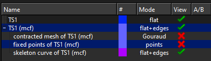
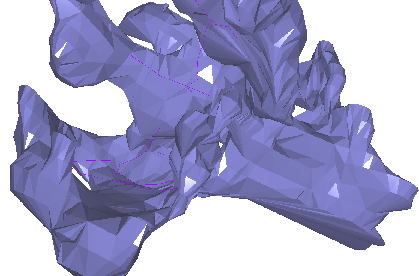

# Skeletons

MASCAF needs a 1D skeleton of the triangle mesh. The method used in this project is **mean-curvature flow skeletonization (MCFS)** ([Tagliasacchi et al., 2012](https://theialab.ca/pubs/tagliasacchi2012mcfskel.pdf)), also called Triangulated Surface Mesh Skeletonization (TSMS) in [CGAL](https://www.cgal.org/).

There is **no unique** 1D skeleton of a 3D volume. The true medial axis is generally a mix of sheets and curves. MCFS trades **branching density** against **medial centering**. Those two goals compete; that is why the parameters feel finicky.

## What to use

| Method | When |
|--------|------|
| **pymcfs in this repo** | Default. Automated, same path as the meshes already in `data/`. `uv run python scripts/skeletonize_meshes.py TS1.obj` |
| **CGALLab** | Interactive mesh repair, inspecting one skeleton, exploring TSMS parameters by hand. Windows GUI. Not for batch jobs |
| **CGAL C++ via mascaf** | If you need the original C++ TSMS and are willing to compile CGAL. See the mascaf README. Prefer pymcfs first |

The original recommendation was CGAL/CGALLab, and that is still a valid toolbox (especially hole-filling and 3D alpha wrapping). Skeletonization for this project has since been moved **into `toric_spines_sim` via pymcfs**. You do not need CGALLab to process the spines already in the repo or to add a new watertight OBJ.

Andrea Tagliasacchi’s [starlab-mcfskel](https://github.com/taiya/starlab-mcfskel) is the research code behind CGAL TSMS. CGAL’s Python bindings do **not** include skeletonization.

## pymcfs (supported)

[pymcfs](https://github.com/jmrfox/pymcfs) is a Python MCFS implementation. This repo’s defaults match the toric-spine batch settings: `profile="auto"`, `branching="sparse"`, tip extension on, prune exterior / short leaves / thick hubs, 500 iterations, 300 s timeout.

```bash
uv run python scripts/skeletonize_meshes.py TS1.obj
uv run python scripts/skeletonize_meshes.py --all
```

Output: `data/skeletons/TS{id}.polylines.txt`. Review in `notebooks/tutorial/02_skeletonization_basic` (`SHOW_ALL = True`).

`profile="auto"` automatically chooses contraction settings (including the quality / medial-centering tradeoff). Those options are not the same as CGALLab’s raw QST/MCST sliders; do not paste CGALLab numbers into pymcfs and expect the same contract. If a skeleton is bad, change `--branching` (`sparse` / `balanced` / `dense`) or inspect the mesh for watertightness before hunting scalar weights.

CHOLMOD (`libsuitesparse-dev` / `suite-sparse`) is optional and only speeds **large** meshes.

Any other skeletonizer is fine if it writes the same polylines format.

## CGALLab (optional GUI)

CGALLab is a **Windows** demo, not a full CGAL frontend. Direct download (v6.2): [CGALlab.zip](https://www.cgal.org/demo/6.2/CGALlab.zip). From the [package list](https://doc.cgal.org/latest/Manual/packages.html), look for a “Windows Demo” on Triangulated Surface Mesh Skeletonization.

To skeletonize one OBJ:

1. Start `CGALLab.exe`, green **+**, load the OBJ. The surface should render.
2. **Operations → Triangulated Surface Mesh Skeletonization → Mean Curvature Skeleton (Advanced)**. The mesh disappears — it is hidden; TSMS works on an internal copy.
3. Left panel: enable **is medially centered**. Defaults are Quality Speed Tradeoff (QST / w_H) = 0.1 and Medially Centered Speed Tradeoff (MCST / w_M) = 0.2. Leave other options at their defaults unless you know why.
4. **Run one iteration** (watch contraction) or **Run to convergence**, then **Skeletonize**.
5. In the object list you get a contracted mesh, fixed points, and a **skeleton curve**. Right-click the skeleton curve → **Save as…** → `polylines.txt`.

Inspect the skeleton against the **original** surface before saving (unhide the input mesh; hide the contracted copy).



CGALLab **defaults** often produce a skeleton that exits the mesh. mascaf can push nodes back in, but more of the curve should already lie inside.



For **individual toric spines in pixel coordinates**, values that worked for the mascaf paper models were about **QST = 0.4–0.5** and **MCST = 5–10** (paper fits used **QST = 0.5, MCST = 5**). They are good enough for mascaf, not geometrically perfect.

QST raises branching density; too high → spurious branches into the same volume. MCST pulls toward the medial axis; too high → spurious loops and noise. Optimal values depend on the mesh. Automatically choosing QST/MCST from the mesh is a possible extension; pymcfs `profile="auto"` is the current step in that direction.

## Mesh must be watertight

TSMS/pymcfs need a watertight, single-component surface. CGALLab can fill holes and flag duplicates. If that fails, [3D alpha wrapping](https://doc.cgal.org/latest/Alpha_wrap_3/index.html) builds a new watertight mesh (expensive, watertight by construction).
